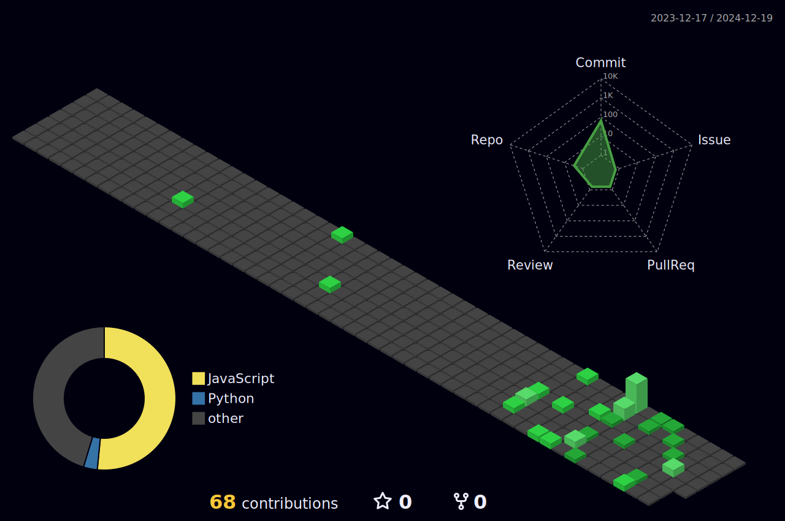

<h2 align="left">Mae Govannen! My name is Felipe</h2>

###

<h3 align="left">About me 📝</h3>

###

I'm a dev with a focus on front-end and I'm perfecting my knowledge in back-end. I love technology in general and want to be part of its growth. I'm currently working on legal software for a university.

###

  
  
  

###

<h3 align="left">Techs 🧑🏻‍💻</h3>

###

Currently Learning: Data Engineering

###

  
  
  
  
  
  
  
  
  

###

  
  
  
  

###

### Contributions

  

###

  
  

###

<h2 align="left">Namárië! ar nai elenillor. 
Farewell, and may the light always shine upon you
 </h2> 

###
